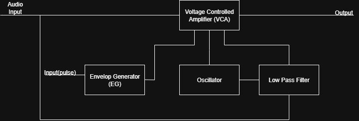
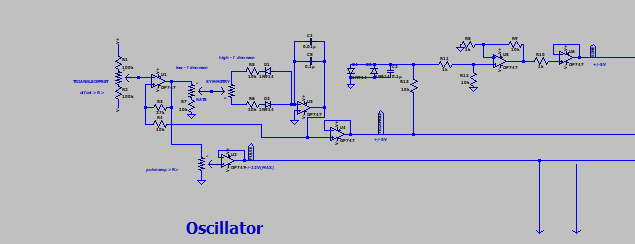
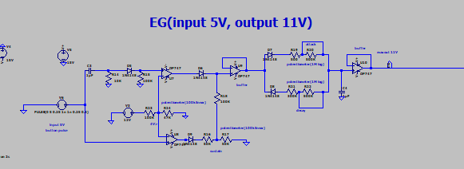
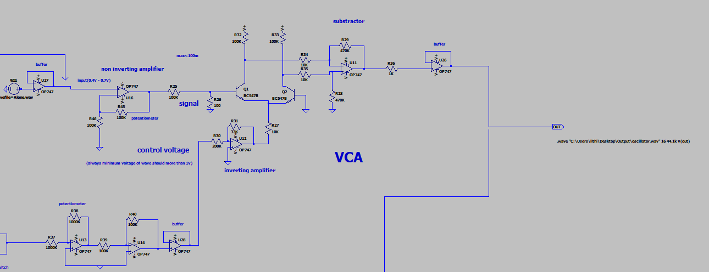
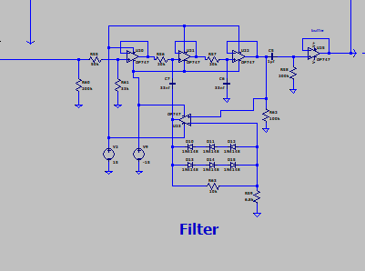
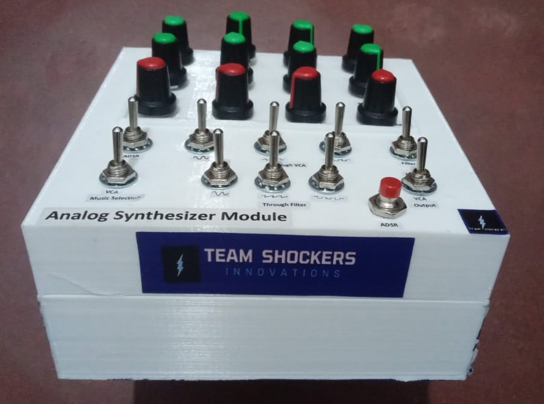

# Analog Synthesizer Module by Team SHOCKERS

Thrilled to unveil our latest creation from Team SHOCKERS! Our **Analog Synthesizer Module** is finally complete after four exciting months of designing and building an authentic and versatile analog synthesizer.

---

## Table of Contents

- [Project Overview](#project-overview)
- [Key Features](#key-features)
- [Technical Contributions](#technical-contributions)
- [Design and Components](#design-and-components)
- [Project Structure](#project-structure)
- [How to Use](#how-to-use)
- [Sample Audio Outputs](#sample-audio-outputs)
- [Acknowledgements & Contact](#acknowledgements--contact)

---

## Project Overview

This project is an entirely **analog synthesizer module** designed to push the boundaries of analog audio engineering and signal processing. It offers musicians and audio enthusiasts a rich palette of sounds with pure analog warmth and expressive control.

Over four months, we researched, designed, simulated, and built this synthesizer incorporating multiple core components such as oscillators, filters, an envelope generator (ADSR), voltage-controlled amplifier (VCA), and seamless audio integration.

---

## Key Features

- **Waveform Diversity**: Generates sine, square, triangle, and sawtooth signals across 50–300 Hz frequency range to create diverse soundscapes.
- **Filtering Capabilities**: Includes an integrated variable cutoff frequency and resonance for precise sound shaping.
- **Seamless Audio Integration**: Mixes synthesized waveforms with input audio for unique, creative effects.
- **Pure Analog Design**: Built completely with analog components to ensure authentic sound quality and character.
- **Envelope Generator (ADSR)**: Controls attack, decay, sustain, and release stages to add dynamic expressiveness.
- **Voltage-Controlled Amplifier (VCA)**: Allows precise amplitude control of the audio signal according to the envelope.

---

## Technical Contributions

**My role** in the project focused on:

- Designing and analyzing the **Envelope Generator (ADSR)** circuit, ensuring dynamic control over the sound's articulation.
- Designing and implementing the **Voltage-Controlled Amplifier (VCA)** for precise volume modulation.
- Integrating and connecting all major submodules — Oscillator, Envelope Generator, Filter, and VCA — to achieve cohesive audio signal flow and performance.

Through these contributions, I helped bridge the individual parts into a working analog synthesizer module.

---

## Design and Components

Our synthesizer is composed of the following functional blocks:

- **Oscillator Module**: Produces fundamental waveforms (sine, square, triangle, sawtooth) with adjustable frequency.
- **Envelope Generator (ADSR)**: Creates dynamic envelopes controlling amplitude and filter modulation.
- **Voltage-Controlled Amplifier (VCA)**: Modulates output signal amplitude according to the ADSR envelope.
- **Low-Pass Filter**: Provides tone shaping with adjustable cutoff frequency and resonance.
- **Audio Mixer**: Combines oscillator outputs with external audio input for creative sound blending.

Each block was carefully designed with analog ICs, transistors, and passive components to maintain sound fidelity and responsiveness.

---
## Gallery

Below are some snapshots of the project through its stages of development and design:

### Block Diagram


### Oscillator Circuit


### Envelope Generator (ADSR)


### Voltage-Controlled Amplifier


### Low-Pass Filter


### PCB 3D Model


### Final Product


### Enclosure Details


## Project Structure

```
Analog-Synthesizer/
├── Images/
│ ├── Blockdiagram.png
│ ├── Enclosure_bottom_part.jpg
│ ├── Enclosure_upper_part.jpg
│ ├── Envelope_Generator.png
│ ├── Final_Product.jpg
│ ├── Low_pass_filter.png
│ ├── Oscillator.png
│ ├── PCB-3D_model.jpg
│ ├── PCB.jpg
│ └── Voltage_controlled_amplifier.png
│
├── Sample_output_audio_files/
│ ├── Mix_with_ADSR.wav
│ ├── Mix_with_filter_output.wav
│ └── Mix_with_pulse_range.mp3
│
├── Simulation_File/
│ └── AnalogSynthesizer.asc
│
├── Simulation_Results/
│ ├── Output - mix with a song and adsr (EG).jpg
│ ├── Output - mix with a song and pulse range (oscillator).jpg
│ ├── Output - mix with a song and triangle (oscillator).jpg
│ └── Output - mix with sine and sine(oscillator).jpg
│
└── README.md
```

You will find all design schematics, photos of the enclosure, PCB models, simulation files, and sample audio outputs organized in their respective folders.

---

## How to Use

1. Review the schematic and block diagrams in the `Images` folder for an overview of the design and interconnections.
2. Use the simulation file (`AnalogSynthesizer.asc`) in LTspice or compatible simulator to analyze signal waveforms and verify circuit behavior.
3. Listen to sample audio files in `Sample_output_audio_files` to experience the different sound textures produced by the synthesizer.
4. For assembly, refer to PCB images and enclosure photos to guide the hardware implementation.

---

## Sample Audio Outputs

To experience the synthesizer's versatility, explore these included audio samples:

- **Mix_with_ADSR.wav** – Demonstrates dynamic amplitude modulation via the Envelope Generator.
- **Mix_with_filter_output.wav** – Showcases the interaction of filtering with the input audio.
- **Mix_with_pulse_range.mp3** – Highlights rich pulse waveform modulation effects.

---

## Acknowledgements & Contact

This project was an incredible learning journey combining analog electronics design and audio engineering.

We thank everyone who contributed knowledge and support, and invite you to share your feedback or collaborate.

For questions or comments, please contact Team SHOCKERS or open an issue on this repository.

---

*Created by Team SHOCKERS | Analog Audio Engineering enthusiasts*
